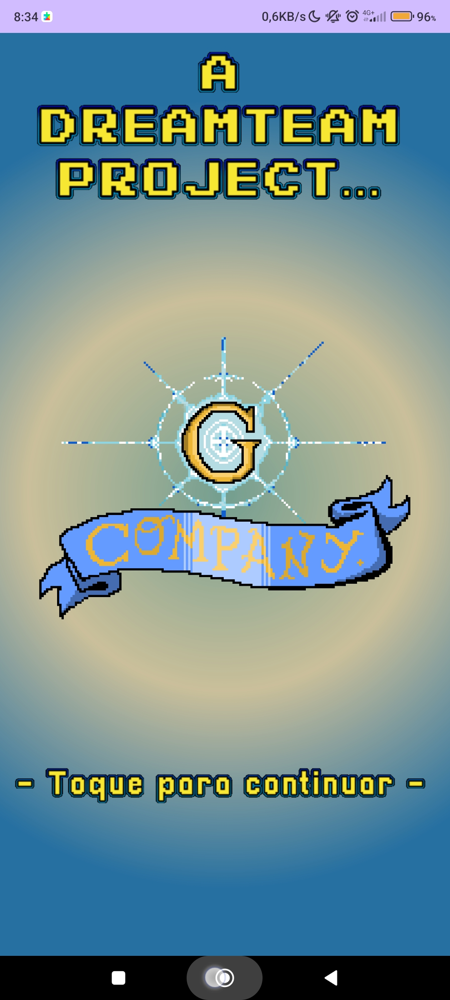
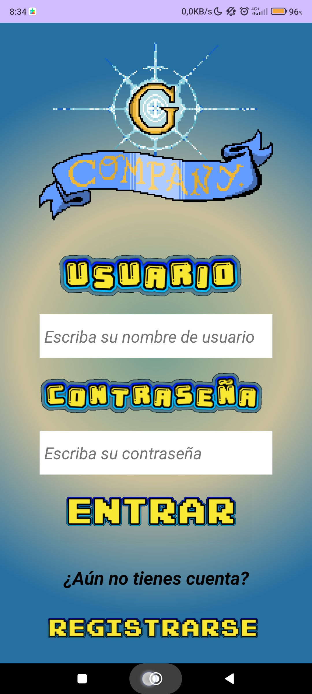
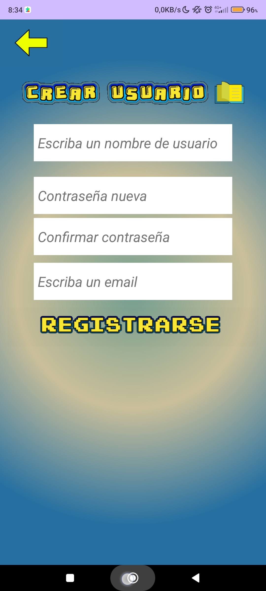
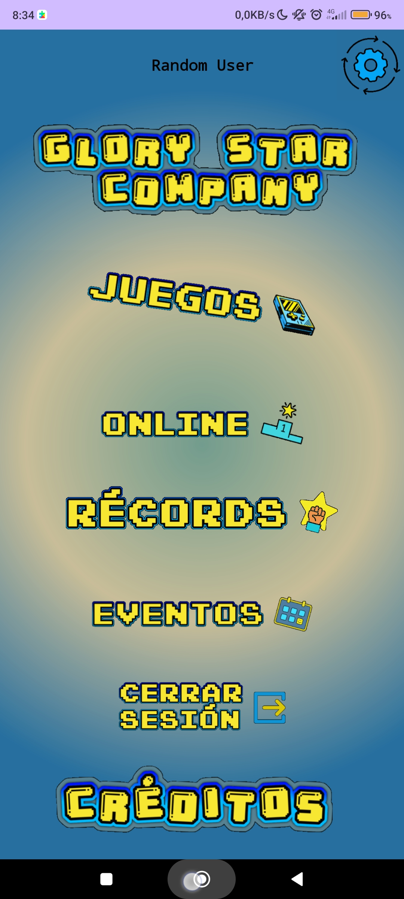
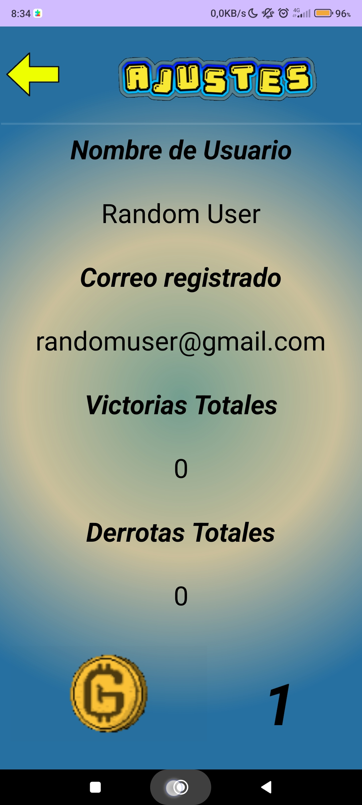
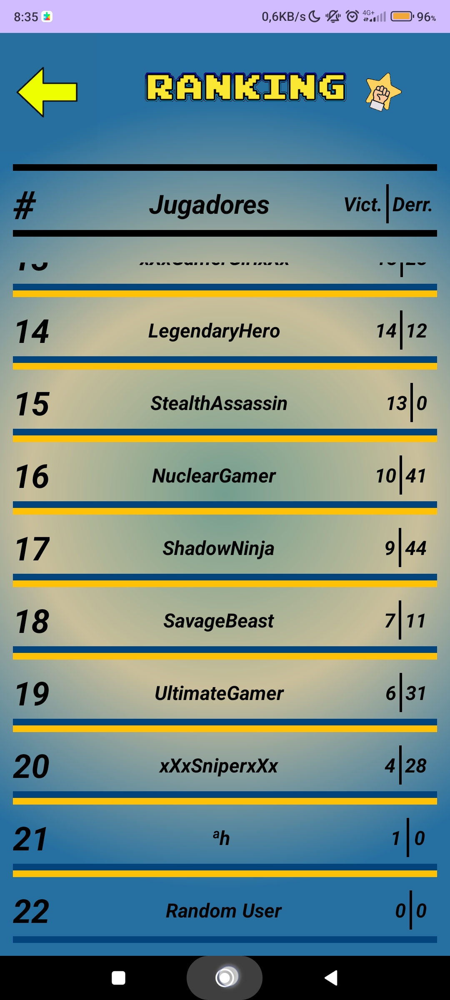
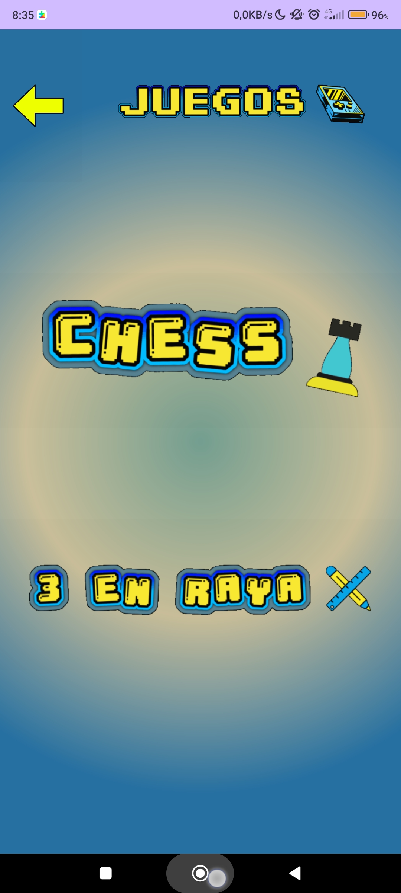
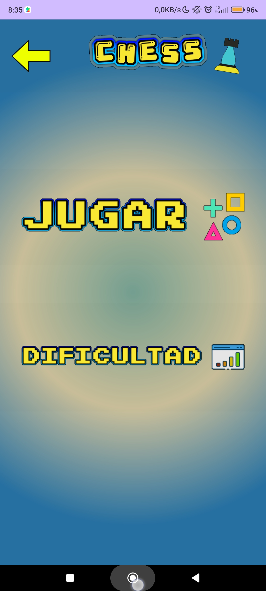
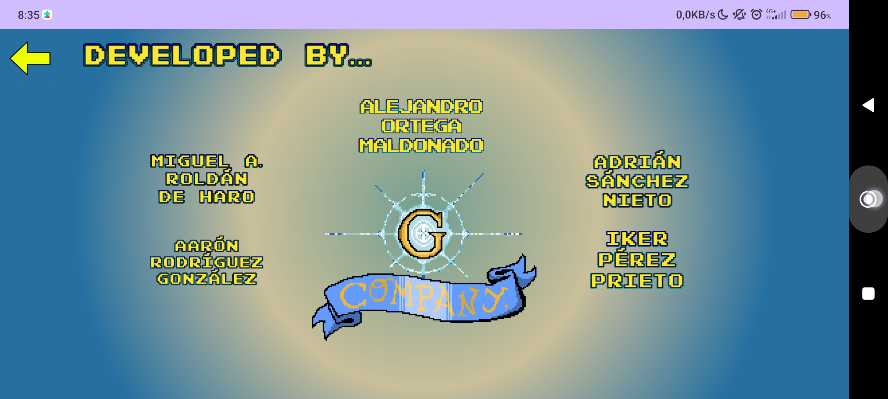

# Glory Star Company Logo.

    

## Screenshot 1

    

## Screenshot 2

    

## Screenshot 3

    

## Screenshot 4

    

## Screenshot 5

    

## Screenshot 6

    

## Screenshot 7

    

## Screenshot 8

    

## Screenshot 9

    

